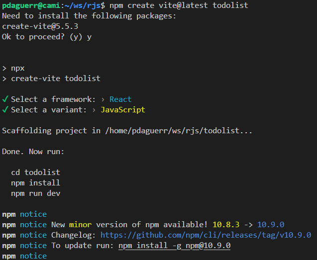

# rjs

If you're looking for flexibility and scalability with a robust ecosystem, **React.js or Next.js** **"libraries"** would be suitable choices, especially if SEO is a concern.

For enterprise-level applications or when you need a complete **"framework"** out of the box, **Angular** is ideal.

If rapid prototyping and a **"no-code approach IA Oriented"** align with your project needs, consider **v0.dev**. 

Ultimately, the best choice depends on your project specifics, team skills, and long-term goals.

---
# React compendium

**Index:**

[1. Components](#1-components)

[2. JSX (JavaScript XML)](#2-jsx-javascript-xml)

[3. Props (Properties)](#3-props-properties)

[4. State and Effect](#4-state)

[5. Lifecycle Methods](#5-lifecycle-methods)

[6. Hooks](#6-hooks)

[7. Virtual DOM](#7-virtual-dom)

[8. Reconciliation](#8-reconciliation)

[9. Conditional rendering](#9-conditional-rendering)

[10. Lists and keys](#10-lists-and-keys)

[11. Context API](#11-context-api)

[12. React Router](#12-react-router)

[13. Higher Order Components (HOC)](#13-higher-order-components-hoc)

[14. Fragments](#14-fragments)

[15. Portals](#15-portals)

[16. Error Boundaries](#16-error-boundaries)

[17. Redux](#17-redux)

[18. Closures](#18-closures-in-react)

[19. Handling Forms](#19-handling-forms)

[20. Immutable State Updates](#20-immutable-state-updates)

[21. Memoization](#21-memoization)

[22. PropTypes and Type Checking](#22-prop-types-and-type-checking)

[23. Server-Side Rendering](#23-server-side-rendering-ssr)

[24. Code Splitting](#24-code-splitting)

[25. React Performance Optimization](#25-react-performance-optimization)

[26. Custom Hooks](#26-custom-hooks)

[27. Portal Rendering with Modals](#27-portal-rendering-with-modals)

[28. Internationalization](#28-internationalization-i18n)

[29. Unit Testing with Jest and Enzyme](#29-unit-testing-with-jest-and-enzyme)

[30. Handling Side Effects with Middleware](#30-handling-side-effects-with-middleware)

[31. Pre-requisites](#31-pre-requisites)

[32. Additional JS General Concepts](#32-additional-js-general-concepts)

---
### 1. **Components**

**Explanation:**

**Components are the building blocks of a React application. They allow you to split the UI into independent, reusable pieces that can be managed separately.** There are two types of components:

- **Class Components**: ES6 classes that extend `React.Component` and have access to lifecycle methods and state.
- **Function Components: Functions that return JSX and can use React features through hooks.**

**Examples:**

**Class Component:**

```jsx
import React from 'react';

class Welcome extends React.Component {
  render() {
    return <h1>Hello, {this.props.name}</h1>;
  }
}

export default Welcome;
```

**Function Component:**

```jsx
import React from 'react';

function Welcome(props) {
  return <h1>Hello, {props.name}</h1>;
}

export default Welcome;
```

---

### 2. **JSX (JavaScript XML)**

**Explanation:**

JSX is a syntax extension for JavaScript that looks similar to HTML. It allows you to write HTML elements directly within JavaScript and place them in the DOM without any `createElement()` or `appendChild()` methods.

**Examples:**

**With JSX:**

```jsx
const element = <h1>Hello, world!</h1>;
```

**Without JSX:**

```jsx
const element = React.createElement('h1', null, 'Hello, world!');
```

---

### 3. **Props (Properties)**

**Explanation:**

Props are inputs to components that allow data to be passed from parent to child components. They are read-only, meaning a component cannot modify its own props.

**Example:**

**Parent Component Passing Props:**

```jsx
function App() {
  return <Greeting name="Alice" />;
}
```

**Child Component Receiving Props:**

```jsx
function Greeting(props) {
  return <h1>Hello, {props.name}!</h1>;
}
```

---

### 4. **State and Effect**

**Explanation:**

**State** is a built-in object that holds property values that belong to a component. **When the state changes, the component re-renders.** ***Normally used for user input data hold at page level (lost in refresh).***

**Example:**

**Using `useState` Hook:**

```jsx
import React, { useState } from 'react';

function Counter() {
  const [count, setCount] = useState(0); // Initialize state

  return (
    <div>
      <p>You clicked {count} times</p>
      <button onClick={() => setCount(count + 1)}>Click me</button>
    </div>
  );
}
```

**`useEffect` is a hook that allows you to perform side effects in function components.** It replaces lifecycle methods like `componentDidMount`, `componentDidUpdate`, and `componentWillUnmount` in class components. Side effects could be anything that interacts with external systems, such as data fetching, subscriptions, or manually updating the DOM. ***It can be used to store "state" data in the Local storage, so the information isn't lost when page is refreshed, i.e. preserved in the local storage***. 

### Syntax:
```javascript
useEffect(() => {
  // Effect code (side effect)
  
  return () => {
    // Optional cleanup code (runs before the component unmounts or before re-running the effect on update)
  };
}, [dependencies]);
```

**Effect Arguments/Run and Cleanup:**

1. **First Argument (Effect function): This is the function that contains your side effect logic.** It runs after the initial render and after every update by default.
   
2. **Second Argument (Dependency array)**: You can **control when the effect runs by passing an array of dependencies.**
   - If the **array is empty, `useEffect` runs only "once"** after the initial render, mimicking `componentDidMount`.
   - If **specific variables are in the array, `useEffect` runs every time those "variables change".**
   - If **no array** is passed, it **runs after "every" render**.

3. **Cleanup: If your effect involves subscriptions, timers, or any resource that needs cleanup, you can return a function from the effect.** React calls this cleanup function before running the effect the next time, and when the component is unmounted.

***Examples:***

1. **Basic usage (runs after each render/re-render of component)**:
   ```javascript
   useEffect(() => {
     document.title = `You clicked ${count} times`;
   }); // no array, runs after every render/re-render of component
   ```

2. **Run once (on mount) with cleanup**:
   ```javascript
   useEffect(() => {
     const timer = setInterval(() => {
       console.log('Timer running');
     }, 1000);

     // Cleanup function (runs when the component is unmounted)
     return () => {
       clearInterval(timer);
     };
   }, []); // empty dependency array runs once on mount
   ```

3. **Run on specific state change**:
   ```javascript
   useEffect(() => {
     console.log('Count changed to', count);
   }, [count]); // array with dependencies, i.e. only runs when 'count' changes
   ```

**Common Use Cases:**

- Fetching data from an API (`useEffect` with async functions)
- Subscribing to an event listener or WebSocket
- Setting up intervals or timers
- **Interacting with the DOM (updating document title, manipulating refs)**

`useEffect` simplifies handling side effects and lifecycle events, especially when paired with React's functional component paradigm.

Here’s an **example of how you can use `useEffect` in React to store data in local storage and retrieve it upon component mount**:

***Example:***

```javascript
import React, { useState, useEffect } from 'react';

const Counter = () => {
  // Initialize the state from localStorage if it exists, otherwise start at 0
  const [count, setCount] = useState(() => {
    return parseInt(localStorage.getItem('count')) || 0;
  });

  // Store the count in localStorage whenever it changes
  useEffect(() => {
    localStorage.setItem('count', count);
  }, [count]); // Effect runs when `count` changes

  return (
    <div>
      <h1>Count: {count}</h1>
      <button onClick={() => setCount(count + 1)}>Increment</button>
      <button onClick={() => setCount(count - 1)}>Decrement</button>
    </div>
  );
};

export default Counter;
```

**Explanation:**

1. **State Initialization with localStorage**:
   - The `useState` hook is used to initialize the `count` state. Instead of setting an initial value directly (like `useState(0)`), we provide a function that checks `localStorage` for an existing value (`localStorage.getItem('count')`). If a value exists, it converts it to an integer using `parseInt`; otherwise, it defaults to 0.

2. **Effect to Save in localStorage**:
   - ⚠️ **`useEffect` is used to store the `count` value in `localStorage` whenever it changes. This ensures that after each increment or decrement, the updated value is saved, keeping the data persistent across page reloads.**
   - The **dependency array `[count]` ensures that the effect only runs when the `count` "changes"**.

3. **Retrieving from localStorage**:
   - The function passed to **`useState` is only executed during the initial render. So, when the component mounts, it reads the value from `localStorage` (if it exists) and uses it as the initial state.**

**Notes:**
- The function in `useState` (`() => parseInt(localStorage.getItem('count')) || 0`) is called a *lazy initializer*, which helps optimize performance by not reading from `localStorage` on every render, but only on the initial render.
- `localStorage` stores data as strings, so we use `parseInt` to convert the value back to a number.

This approach ensures that the state persists between page reloads and browser sessions, which is common for counters, preferences, form data, etc.

---

### 5. **Lifecycle Methods**

**Explanation:**

Lifecycle methods are special methods in class components that get called at different stages of a component's existence, such as mounting, updating, and unmounting.

**Example:**

**Using `componentDidMount`:**

```jsx
import React from 'react';

class DataFetcher extends React.Component {
  state = { data: null };

  componentDidMount() {
    fetch('/api/data')
      .then((response) => response.json())
      .then((data) => this.setState({ data }));
  }

  render() {
    return <div>{this.state.data}</div>;
  }
}
```

---

### 6. **Hooks**

**Explanation:**

Hooks are functions that let you "hook into" React state and lifecycle features from function components. They allow you to use state and other React features without writing a class.

**Common Hooks:**

- `useState`
- `useEffect`
- `useContext`

**Examples:**

**Using `useEffect` Hook:**

```jsx
import React, { useState, useEffect } from 'react';

function DataFetcher() {
  const [data, setData] = useState(null);

  useEffect(() => {
    // This code runs after the component mounts
    fetch('/api/data')
      .then((response) => response.json())
      .then((data) => setData(data));
  }, []); // Empty array ensures this runs once

  return <div>{data}</div>;
}
```

---

### 7. **Virtual DOM**

**Explanation:**

The Virtual DOM is an in-memory representation of the real DOM elements generated by React components before any changes are made to the page. When the state of an object changes, the Virtual DOM changes only that object in the real DOM, rather than updating all the objects.

**Visualization:**

- **Step 1:** Render the initial UI to the Virtual DOM.
- **Step 2:** When state changes, React creates a new Virtual DOM tree.
- **Step 3:** React compares the new Virtual DOM with the previous one (diffing).
- **Step 4:** React updates the real DOM with only the changed elements.

---

### 8. **Reconciliation**

**Explanation:**

Reconciliation is the process through which React updates the DOM. When a component's state changes, React updates the Virtual DOM, compares it with the previous version, and efficiently updates the actual DOM to match.

**Key Points:**

- React uses a diffing algorithm to compare Virtual DOM trees.
- Only the parts of the DOM that have changed are updated.

---

### 9. **Conditional Rendering**

**Explanation:**

Conditional rendering in React works the same way conditions work in JavaScript. You can create distinct components that encapsulate the behavior you need, and render only some of them depending on the state of your application.

**Examples:**

**Using `if-else`:**

```jsx
function Greeting(props) {
  if (props.isLoggedIn) {
    return <h1>Welcome back!</h1>;
  } else {
    return <h1>Please sign up.</h1>;
  }
}
```

**Using Ternary Operator:**

```jsx
function Greeting(props) {
  return props.isLoggedIn ? <h1>Welcome back!</h1> : <h1>Please sign up.</h1>;
}
```

**Using Logical `&&`:**

```jsx
function Mailbox(props) {
  const unreadMessages = props.unreadMessages;
  return (
    <div>
      <h1>Hello!</h1>
      {unreadMessages.length > 0 && (
        <h2>You have {unreadMessages.length} unread messages.</h2>
      )}
    </div>
  );
}
```

---

### 10. **Lists and Keys**

**Explanation:**

When you need to build lists of elements, React allows you to use the `.map()` function to transform an array into a list of elements. Keys help React identify which items have changed, are added, or are removed.

**Example:**

```jsx
const numbers = [1, 2, 3, 4, 5];
const listItems = numbers.map((number) => (
  <li key={number.toString()}>{number}</li>
));

function NumberList() {
  return <ul>{listItems}</ul>;
}
```

---

### 11. **Context API**

**Explanation:**

The Context API provides a way to pass data through the component tree without having to pass props down manually at every level. It is ideal for global data like themes, user authentication, or preferred language.

**Example:**

**Creating a Context:**

```jsx
const ThemeContext = React.createContext('light');
```

**Providing Context Value:**

```jsx
function App() {
  return (
    <ThemeContext.Provider value="dark">
      <Toolbar />
    </ThemeContext.Provider>
  );
}
```

**Consuming Context Value:**

```jsx
function ThemedButton() {
  const theme = React.useContext(ThemeContext);
  return <button className={`button-${theme}`}>Click Me</button>;
}
```

---

### 12. **React Router**

**Explanation:**

React Router is a third-party library that enables navigation among views of various components in a React application, allows changing the browser URL, and keeps the UI in sync with the URL.

**Example:**

```jsx
import React from 'react';
import { BrowserRouter as Router, Route, Switch, Link } from 'react-router-dom';

function Home() {
  return <h2>Home</h2>;
}

function About() {
  return <h2>About</h2>;
}

function App() {
  return (
    <Router>
      <div>
        <nav>
          <Link to="/">Home</Link>
          {' | '}
          <Link to="/about">About</Link>
        </nav>

        <Switch>
          <Route exact path="/" component={Home} />
          <Route path="/about" component={About} />
        </Switch>
      </div>
    </Router>
  );
}

export default App;
```

---

### 13. **Higher-Order Components (HOC)**

**Explanation:**

A Higher-Order Component is a function that takes a component and returns a new component. They are used to share common functionality between components without repeating code.

**Example:**

**Creating an HOC:**

```jsx
function withLogging(WrappedComponent) {
  return class extends React.Component {
    componentDidMount() {
      console.log('Component Mounted');
    }

    render() {
      return <WrappedComponent {...this.props} />;
    }
  };
}
```

**Using the HOC:**

```jsx
function MyComponent(props) {
  return <div>{props.text}</div>;
}

const EnhancedComponent = withLogging(MyComponent);

// Usage
<EnhancedComponent text="Hello World" />;
```

---

### 14. **Fragments**

**Explanation:**

Fragments let you group a list of children without adding extra nodes to the DOM. This is useful when a component must return multiple elements, but you don't want to wrap them in an extra DOM element.

**Examples:**

**Using `<React.Fragment>`:**

```jsx
function FragmentExample() {
  return (
    <React.Fragment>
      <h1>Title</h1>
      <p>Description</p>
    </React.Fragment>
  );
}
```

**Using Short Syntax (`<>`):**

```jsx
function FragmentExample() {
  return (
    <>
      <h1>Title</h1>
      <p>Description</p>
    </>
  );
}
```

---

### 15. **Portals**

**Explanation:**

Portals provide a way to render children into a DOM node that exists outside the DOM hierarchy of the parent component. This is often used for rendering modals, tooltips, and other elements that need to appear above other elements.

**Example:**

**Creating a Portal:**

```jsx
import ReactDOM from 'react-dom';

function Modal({ children }) {
  return ReactDOM.createPortal(
    <div className="modal">{children}</div>,
    document.getElementById('modal-root') // This is a div outside your main app div
  );
}

function App() {
  return (
    <div className="app">
      <h1>My App</h1>
      <Modal>
        <p>This is a modal!</p>
      </Modal>
    </div>
  );
}
```

---

### 16. **Error Boundaries**

**Explanation:**

Error boundaries are React components that catch JavaScript errors anywhere in their child component tree, log those errors, and display a fallback UI instead of the component tree that crashed.

**Example:**

```jsx
class ErrorBoundary extends React.Component {
  constructor(props) {
    super(props);
    this.state = { hasError: false };
  }

  static getDerivedStateFromError(error) {
    // Update state so the next render will show fallback UI.
    return { hasError: true };
  }

  componentDidCatch(error, errorInfo) {
    // You can log error information here
    console.error('Error:', error, 'Info:', errorInfo);
  }

  render() {
    if (this.state.hasError) {
      // Fallback UI
      return <h1>Something went wrong.</h1>;
    }

    return this.props.children;
  }
}

// Usage
function App() {
  return (
    <ErrorBoundary>
      <MyWidget />
    </ErrorBoundary>
  );
}
```

---

### 17. **Redux**

**Explanation:**

Redux is a predictable state container for JavaScript apps. It helps you manage the application state in a single place called the store, making it easier to debug and test your app. While Redux can be used with any UI layer, it is commonly used with React.

**Core Concepts:**

- **Store:** Holds the entire state of your application.
- **Actions:** Plain JavaScript objects that represent changes in the state.
- **Reducers:** Pure functions that take the previous state and an action, and return the next state.
- **Dispatch:** A method to send actions to the store.

**Example:**

**Installing Redux and React-Redux:**

```bash
npm install redux react-redux
```

**Creating an Action:**

```jsx
// actions.js
export const increment = () => ({
  type: 'INCREMENT',
});

export const decrement = () => ({
  type: 'DECREMENT',
});
```

**Creating a Reducer:**

```jsx
// reducer.js
const initialState = { count: 0 };

export default function counter(state = initialState, action) {
  switch (action.type) {
    case 'INCREMENT':
      return { count: state.count + 1 };
    case 'DECREMENT':
      return { count: state.count - 1 };
    default:
      return state;
  }
}
```

**Creating the Store:**

```jsx
// store.js
import { createStore } from 'redux';
import counter from './reducer';

const store = createStore(counter);

export default store;
```

**Connecting React and Redux:**

```jsx
// App.js
import React from 'react';
import { Provider, useSelector, useDispatch } from 'react-redux';
import store from './store';
import { increment, decrement } from './actions';

function Counter() {
  const count = useSelector((state) => state.count);
  const dispatch = useDispatch();

  return (
    <div>
      <p>Count: {count}</p>
      <button onClick={() => dispatch(increment())}>+</button>
      <button onClick={() => dispatch(decrement())}>-</button>
    </div>
  );
}

function App() {
  return (
    <Provider store={store}>
      <Counter />
    </Provider>
  );
}

export default App;
```

---

### 18. **Closures in React**

A **closure** is a feature in JavaScript where an inner function has access to the variables of its outer function, even after the outer function has returned. This allows the inner function to "remember" the scope in which it was created.

**Key Points:**

- The inner function can access variables from its outer function's scope.
- The outer function’s variables are kept alive (even after the function has executed) because the inner function holds a reference to them.

***Example:***

```javascript
function outer() {
  let count = 0; // Local variable in outer function

  function inner() {
    count++; // Inner function accesses the outer variable
    console.log(count);
  }

  return inner;
}

const increment = outer(); // outer() returns inner function
increment(); // Logs: 1
increment(); // Logs: 2
```

In this example, `inner` forms a closure over `count` from the `outer` function. Even though `outer` has finished executing, the `inner` function still has access to `count`, and each time `increment` is called, it remembers and updates that value.

**Further Explanation:**

A closure is a feature in JavaScript where an inner function has access to variables in its outer enclosing function's scope, even after the outer function has returned. In React, closures are often encountered when dealing with hooks and event handlers.

**Example:**

**Using Closures in Event Handlers:**

```jsx
import React, { useState } from 'react';

function Counter() {
  const [count, setCount] = useState(0);

  function handleClick() {
    setCount((prevCount) => prevCount + 1);
  }

  return <button onClick={handleClick}>{count}</button>;
}
```

In this example, `handleClick` forms a closure over `setCount` and `count`. Using the functional form of `setCount` ensures you always have the latest state value, avoiding potential bugs with stale closures.

**Common Pitfall: Stale Closures in `useEffect`**

```jsx
import React, { useState, useEffect } from 'react';

function Timer() {
  const [seconds, setSeconds] = useState(0);

  useEffect(() => {
    const interval = setInterval(() => {
      // This will capture the initial 'seconds' value (0)
      setSeconds(seconds + 1);
    }, 1000);

    return () => clearInterval(interval);
  }, []); // Empty dependency array

  return <div>{seconds} seconds have elapsed.</div>;
}
```

**Fixing Stale Closure:**

```jsx
useEffect(() => {
  const interval = setInterval(() => {
    setSeconds((prevSeconds) => prevSeconds + 1);
  }, 1000);

  return () => clearInterval(interval);
}, []);
```

Using the functional form `setSeconds((prevSeconds) => prevSeconds + 1)` ensures that the latest value is used every time the interval callback runs.

---

### 19. **Handling Forms**

**Explanation:**

Handling forms in React involves managing the state of form elements and handling user input. Controlled components are the most common way to handle form inputs in React.

**Example:**

```jsx
import React, { useState } from 'react';

function NameForm() {
  const [value, setValue] = useState('');

  function handleChange(event) {
    setValue(event.target.value);
  }

  function handleSubmit(event) {
    alert('A name was submitted: ' + value);
    event.preventDefault();
  }

  return (
    <form onSubmit={handleSubmit}>
      <label>
        Name:
        <input type="text" value={value} onChange={handleChange} />
      </label>
      <input type="submit" value="Submit" />
    </form>
  );
}
```

---

### 20. **Immutable State Updates**

**Explanation:**

In React, state should be treated as immutable. When updating state, especially in arrays or objects, you should create a new copy of the state rather than modifying the existing state directly.

**Examples:**

**Updating an Array:**

```jsx
const [items, setItems] = useState([]);

function addItem(newItem) {
  setItems([...items, newItem]); // Spread operator creates a new array
}
```

**Updating an Object:**

```jsx
const [user, setUser] = useState({ name: 'Alice', age: 25 });

function updateAge(newAge) {
  setUser({ ...user, age: newAge }); // Spread operator creates a new object
}
```

---

### 21. **Memoization**

**Explanation:**

Memoization in React is a performance optimization technique used to speed up expensive function calls by caching their results. React provides hooks like `useMemo` and `useCallback` for memoization.

**Examples:**

**Using `useMemo`:**

```jsx
import React, { useState, useMemo } from 'react';

function ExpensiveComponent({ num }) {
  const computedValue = useMemo(() => {
    // Expensive computation
    return num * 2;
  }, [num]);

  return <div>Computed Value: {computedValue}</div>;
}
```

**Using `useCallback`:**

```jsx
import React, { useState, useCallback } from 'react';

function ParentComponent() {
  const [count, setCount] = useState(0);

  const handleClick = useCallback(() => {
    // Function logic
  }, []); // Dependencies

  return <ChildComponent onClick={handleClick} />;
}
```

---

### 22. **Prop Types and Type Checking**

**Explanation:**

PropTypes allow you to document the intended types of properties passed to components. This helps catch bugs by ensuring that components receive the correct data types.

**Example:**

```jsx
import React from 'react';
import PropTypes from 'prop-types';

function Greeting({ name }) {
  return <h1>Hello, {name}</h1>;
}

Greeting.propTypes = {
  name: PropTypes.string.isRequired,
};

export default Greeting;
```

---

### 23. **Server-Side Rendering (SSR)**

**Explanation:**

Server-side rendering is the ability to render React components on the server and send the HTML to the client, improving performance and SEO.

**Example with Next.js:**

Next.js is a popular framework for SSR with React.

```jsx
// pages/index.js
function Home({ data }) {
  return <div>Data from server: {data}</div>;
}

export async function getServerSideProps() {
  // Fetch data from external API
  const res = await fetch('https://api.example.com/data');
  const data = await res.json();

  // Pass data to the page via props
  return { props: { data } };
}

export default Home;
```

---

### 24. **Code Splitting**

**Explanation:**

Code splitting allows you to split your code into various bundles which can then be loaded on demand. This can help reduce the initial load time of your app.

**Example:**

```jsx
import React, { Suspense, lazy } from 'react';

const OtherComponent = lazy(() => import('./OtherComponent'));

function MyComponent() {
  return (
    <div>
      <Suspense fallback={<div>Loading...</div>}>
        <OtherComponent />
      </Suspense>
    </div>
  );
}
```

---

### 25. **React Performance Optimization**

**Explanation:**

Optimizing performance in React involves various techniques:

- **Using `shouldComponentUpdate` or `React.memo`**: Prevent unnecessary re-renders.
- **Avoiding Inline Functions in Render**: Inline functions can cause re-renders.
- **Optimizing State Management**: Keep state minimal and avoid deep nested states.
- **Lazy Loading Components**: Load components only when needed.

---

### 26. **Custom Hooks**

**Explanation:**

Custom hooks are functions that start with `use` and can call other hooks. They allow you to extract component logic into reusable functions.

**Example:**

```jsx
import { useState, useEffect } from 'react';

function useFetch(url) {
  const [data, setData] = useState(null);

  useEffect(() => {
    fetch(url)
      .then((res) => res.json())
      .then(setData);
  }, [url]);

  return data;
}

// Usage
function App() {
  const data = useFetch('/api/data');

  return <div>{data ? data.message : 'Loading...'}</div>;
}
```

---

### 27. **Portal Rendering with Modals**

**Explanation:**

Portals are often used for rendering modals that need to appear above other content.

**Example:**

```jsx
// Modal.js
import React from 'react';
import ReactDOM from 'react-dom';

function Modal({ isOpen, onClose, children }) {
  if (!isOpen) return null;

  return ReactDOM.createPortal(
    <div className="modal-overlay">
      <div className="modal-content">{children}</div>
      <button onClick={onClose}>Close</button>
    </div>,
    document.getElementById('modal-root')
  );
}

export default Modal;
```

---

### 28. **Internationalization (i18n)**

**Explanation:**

Internationalization is the process of designing an application so that it can be adapted to various languages and regions without engineering changes.

**Example with `react-i18next`:**

```jsx
import React from 'react';
import { useTranslation } from 'react-i18next';

function MyComponent() {
  const { t } = useTranslation();

  return <h1>{t('welcome_message')}</h1>;
}
```

---

### 29. **Unit Testing with Jest and Enzyme**

**Explanation:**

Testing is crucial for ensuring your application works as expected. Jest and Enzyme are popular tools for testing React components.

**Example:**

```jsx
// MyComponent.js
import React from 'react';

function MyComponent() {
  return <div>Hello World</div>;
}

export default MyComponent;
```

```jsx
// MyComponent.test.js
import React from 'react';
import { shallow } from 'enzyme';
import MyComponent from './MyComponent';

it('renders without crashing', () => {
  shallow(<MyComponent />);
});
```

---

### 30. **Handling Side Effects with Middleware**

**Explanation:**

In complex applications, handling side effects like API calls can be managed using middleware like Redux Thunk or Redux Saga.

**Example with Redux Thunk:**

```jsx
// actions.js
export const fetchData = () => {
  return (dispatch) => {
    dispatch({ type: 'FETCH_DATA_REQUEST' });
    fetch('/api/data')
      .then((response) => response.json())
      .then((data) => dispatch({ type: 'FETCH_DATA_SUCCESS', payload: data }))
      .catch((error) => dispatch({ type: 'FETCH_DATA_FAILURE', error }));
  };
};
```

---

By understanding and applying these key concepts, you'll be well-equipped to build efficient, scalable, and maintainable React applications. Each concept plays a crucial role in the React ecosystem, and mastering them will enhance your development skills significantly.

---

### 31. **Pre-requisites**

To install `Node.js` on Ubuntu via the command line, follow these steps:

1. **Update the package list**:
   ```bash
   sudo apt update
   ```

2. **Install the NodeSource repository**:
   To get the latest version, first add the NodeSource PPA for Node.js:
   ```bash
   curl -fsSL https://deb.nodesource.com/setup_22.x | sudo -E bash -
   ```

3. **Install Node.js**:
   After adding the repository, install Node.js with:
   ```bash
   sudo apt install -y nodejs
   ```

4. **Verify the installation**:
   Once the installation is done, confirm the version installed:
   ```bash
   node -v
   ```

This will install the latest stable release of Node.js (currently v22.x).

5. **Create React project, initialize and run using NPM**:

   ```bash
   npm create vite@latest {provide-new-project-name}
   ```

  

6. **Install ES7+ React/Redux/React-Native snippets extension in VS CODE** 

  The extension helps to create functional react components, e.g. write `rfc` inside a new empty file `TodoList.jsx` creates automatically:
  ```jsx
  import React from 'react'

  export default function TodoCard() {
    return (
      <div>TodoCard</div>
    )
  }	
  ```
  
7. **Add Google Custom "Fonts" for Fun in index.html (Already done!)**

  Browse google fonts **`inter`** (select on `Get font` -it will add it to the family of fonts) and then also **`press`** (`Get font`) -2 font families will be added. The Click on `Get embed code`, copy entire link web code and paste it inside **`index.html`** head to add meta information in the page, i.e.:

  ```html
  <!doctype html>
  <html lang="en">
    <head>
      <meta charset="UTF-8" />
      <link rel="icon" type="image/svg+xml" href="/vite.svg" />
      <meta name="viewport" content="width=device-width, initial-scale=1.0" />
      <!-- Custom Fonts -->
      <link rel="preconnect" href="https://fonts.googleapis.com">
      <link rel="preconnect" href="https://fonts.gstatic.com" crossorigin>
      <link href="https://fonts.googleapis.com/css2?family=Inter:ital,opsz,wght@0,14..32,100..900;1,14..32,100..900&family=Press+Start+2P&display=swap" rel="stylesheet">
    </head>
    <body>
      <div id="root"></div>
      <script type="module" src="/src/main.jsx"></script>
    </body>
  </html>
  ```
  Replace `index.css` with the one pre-defined here that uses previous fonts [index.css](https://github.com/paguerre3/reactjs-todolist/blob/main/src/index.css).

8. **Add font-awesome CND 6.x to index.html**

  Browse for [font-awesome](https://cdnjs.com/libraries/font-awesome), `Copy Link Tag` and place it in the head of the page (below custom fonts). 

---

### 32. **Additional JS General Concepts**

**`let`**

In JavaScript, **`let` is a keyword used to declare variables that are block-scoped, meaning the variable is only accessible within the block (e.g., a loop, an `if` statement) in which it is defined**. This is different from the `var` keyword, which is function-scoped or globally scoped, depending on where it's declared.

Key points about `let`:
1. **Block scope**: Variables declared with `let` are confined to the block of code (e.g., inside curly braces `{}`) in which they are defined.
   ```javascript
   if (true) {
       let x = 10;
       console.log(x); // Outputs 10
   }
   console.log(x); // Error: x is not defined
   ```
2. **Re-declaration not allowed**: You cannot redeclare a variable using `let` within the same scope.
   ```javascript
   let x = 5;
   let x = 10; // Error: Identifier 'x' has already been declared
   ```
3. **Temporal dead zone (TDZ)**: Variables declared with `let` cannot be accessed before they are initialized. This period is called the *temporal dead zone*.
   ```javascript
   console.log(x); // ReferenceError: Cannot access 'x' before initialization
   let x = 5;
   ```
4. **No hoisting issues**: Unlike `var`, which is hoisted (i.e., moved to the top of the scope) with `undefined` as its value, `let` does not allow access to the variable before it's defined.

`let` is preferred in most modern JavaScript code because of its predictable scoping behavior compared to `var`, leading to fewer bugs, especially in loops or conditional blocks.